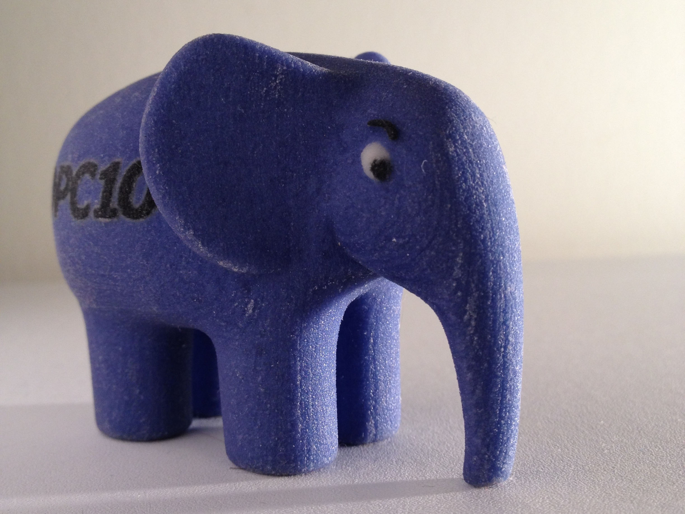

.. role:: white


An example presentation
#######################

.. class:: titleslideinfo

    by Rob Allen


.. Change to a title page
.. raw:: pdf

    PageBreak titlePage


.. class:: centredtitle

A title slide


.. Change to a standard page
.. raw:: pdf

    PageBreak standardPage


This is a title
===============

This is just a paragraph of text that is quite long so that it probably goes over multiple lines. As such it should still look okay though!

    We shall defend our island, whatever the cost may be, we shall fight on the beaches, we shall fight on the landing grounds, we shall fight in the fields and in the streets, we shall fight in the hills; we shall never surrender.

    -- Winston Churchill


This is a very long title here to ensure it wraps correctly
===========================================================

This is just a paragraph of text that is quite long so that it probably goes over multiple lines. As such it should still look okay though!


This is a list
==============

* The first item
* The second item with some ``preformatted`` text
* The third item
  
  with a new line

.. Change to a title page
.. raw:: pdf

    PageBreak titlePage

.. class:: centredtitle

A really really long title for a title slide


.. Change to a standard page
.. raw:: pdf

    PageBreak elephpantPage

.. Full screen image here

:white:`Elephpant!`
===================

.. Change to a standard page
.. raw:: pdf

    PageBreak standardPage


Another slide
=============

This a line of text

This is a sub-title
```````````````````

Some text here and then a list:

1. item 1
2. item 2
3. item 3


Image on a slide
================



Some interesting code here
===========================

.. code-block:: php
   :startinline: true

    class TheatreController extends AbstractActionController
    {
        protected $theatreMapper;

        public function indexAction()
        {
            $mapper = $this->getTheatreMapper();
            $theatres = $mapper->fetchAll();

            return new ViewModel(array('theatres' => $theatres));
        }
    }


.. Change to a title page
.. raw:: pdf

    PageBreak titlePage

.. class:: centredtitle

Thank you

